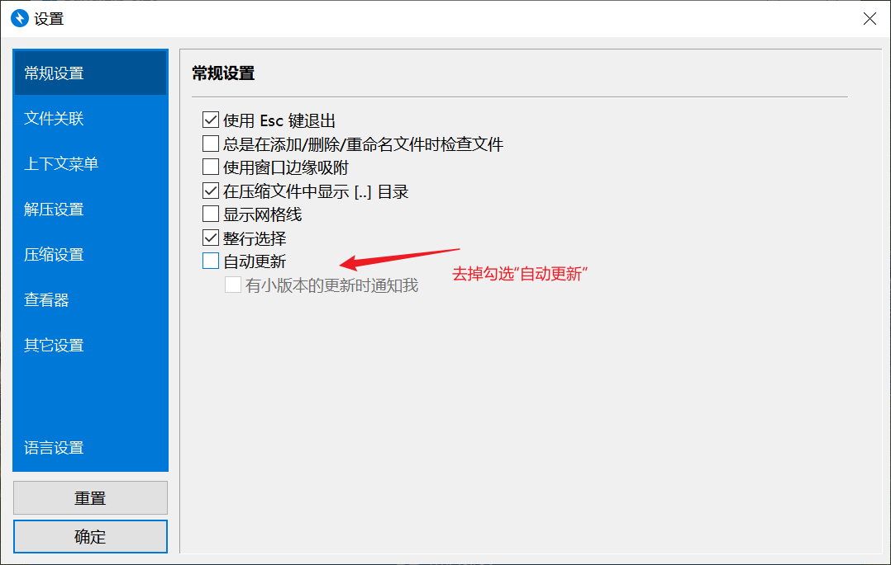
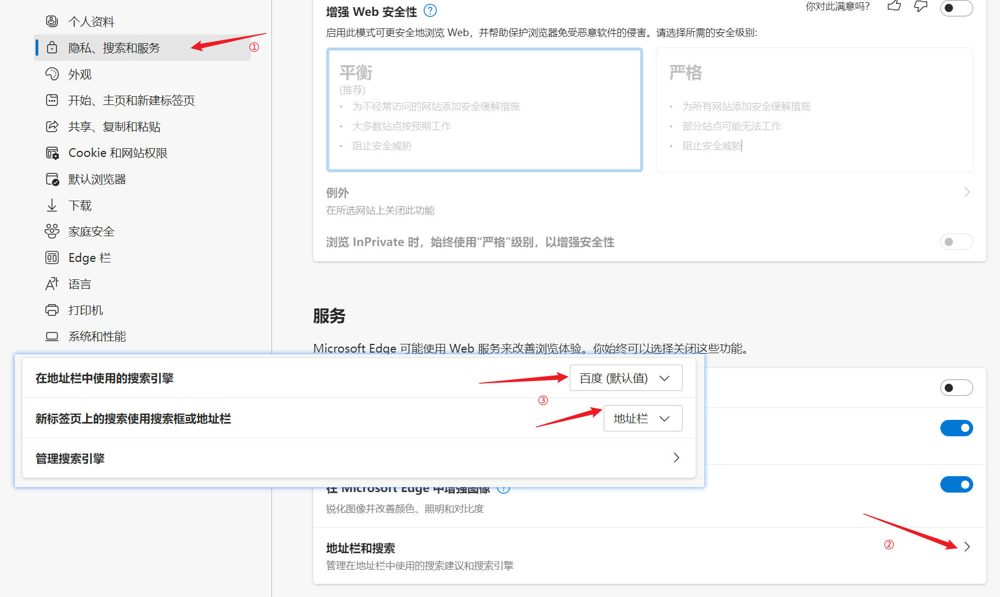
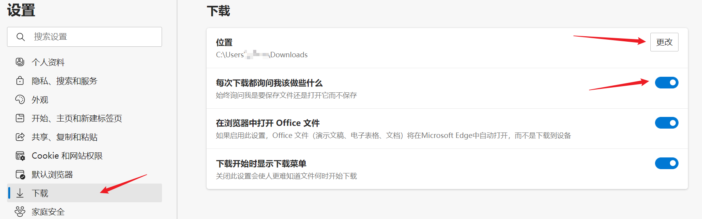

# 1. 系统工具

## Windows激活工具

### HEU_KMS_Activator

**下载地址：[Github发布](https://github.com/zbezj/HEU_KMS_Activator/releases)  |  微信公众号：HEU168  |  [蓝奏云](https://czh0575.lanzouh.com/iEFPx048p6va)**

- 最新版本：v24.6.1
- 一键激活Windows和Office，建议安装完Office之后一次性激活。
- 180天后到期是正常现象，到期再次激活即可。软件可设置KMS自动续期。

### 高校批量正版激活
> **[!WARNING]**
> 仅供厦门大学内部访问，外链需账号密码登录，侵删。

> 请先下载SHA1校验工具（下载完成后务必进行SHA1校验），推荐[iHasher](https://czh0575.lanzoui.com/itwy8u7vzzi)

**[激活脚本下载 >](https://microsoft.xmu.edu.cn/assets/XMU.zip)    |    [使用说明 >](https://microsoft.xmu.edu.cn/windows.html)**

> MD5校验码：485cf77e20577f2dc63d2f28e661c89b

- 原理是高校批量版KMS服务器，原则上180日到期，到期后可再次激活续期。
- 如有正版需求，请务必使用正规渠道  

### 其他激活工具

**下载地址：[蓝奏云 > ](https://czh0575.lanzoui.com/b01iooasb)   密码：hbxx**

- 提取自iwin10装机镜像，如使用[iwin10](../1-系统镜像/1-2.html#iwin10)的镜像可直接在桌面上查看使用。


## 压缩解压

### WinRAR

**下载地址：[蓝奏云](https://czh0575.lanzoui.com/iw4Rhfpd7sd)**

- 5.70破解版本
- 压缩解压RAR专用

### Bandizip 

**下载地址：[蓝奏云](https://czh0575.lanzoui.com/ipuOKu85fve)**

- 最后一个无广告版本，7.x版本有广告
- 安装后**切勿升级**，在选项中取消勾选`自动更新`



### 7-Zip

**下载地址：[官方下载](https://www.7-zip.org/) | [蓝奏云](https://czh0575.lanzouh.com/ihTQ6049ws2b)**

- 最新版本：21.07
- 广受好评的压缩软件之一

## Windows优化

### 图吧工具箱

**下载地址：[官方网站](http://www.tbtool.cn/)  |  [天翼云盘2022.01](https://cloud.189.cn/web/share?code=2EnYrqIvmqea) | [阿里云盘2022.01](https://www.aliyundrive.com/s/bEfn86WQGq9)**

- 最新版本：2022.01正式版
- Windows跑分、检测必备，汇集大量优秀系统工具，如Aida64、Everything、Geek等
- Dism++和Geek均包含在其中，安装完无需再单独下载

### Dism++  
**下载地址：[官方下载](https://github.com/Chuyu-Team/Dism-Multi-language/releases)  |  [蓝奏云](https://czh0575.lanzouh.com/ioEMk049u1wh)**

- 最新版本：10.1.1002.1
- Windows系统管理优化工具，自定义设置和优化，相当于一个 “一站式” 管理优化工具集
- 可用于备份、还原、补丁、封装等

### Geek
**下载地址：[官方下载](https://geekuninstaller.com/download)  |  [蓝奏云](https://czh0575.lanzoui.com/iCZmPu84fif)**

- 强大的Windows卸载工具，可以卸载软件及Store应用
- 完全卸载完后会自动扫描注册表和快捷方式，一键`清理`即可

### 鲁大师绿色单文件版

**下载地址： [蓝奏云](https://czh0575.lanzous.com/iUVfmfpmpli)**

- 旧版娱乐大师，跑分相对比较标准
- 单文件，用完即删，不带流氓插件


## 安全管家

### 火绒安全软件

**下载地址：[官方下载](https://www.huorong.cn/person5.html?status=hrstat&src=1)（下载完整版含扩展工具）**

- 无广告，无捆绑
- 扩展功能比较丰富，基本能覆盖必要功能，弹窗拦截可拦截广告弹窗，效果比腾讯电脑管家要好
- 养成经常清理垃圾、全盘扫描的习惯，并适当清理开机启动项和右键菜单
- 装好后可关闭Windows自带防火墙

### 腾讯电脑管家

**官方网站：[官方下载](https://guanjia.qq.com/)**

- 安装后可在软件管家中下载软件，避免捆绑无用插件
- 相对360安全卫士而言，广告不多

## 浏览器

### Microsoft Edge

**官方网站： [最新版本](https://www.microsoft.com/zh-cn/edge?r=1#evergreen)**

- 最后一版支持Flash的Edge v87（含Flash IE版） 
下载地址：[蓝奏云](https://czh0575.lanzoui.com/b01iw179e)  (密码:26cx)
- 常用设置：
> [!TIP]
> - 在私有电脑上登录Microsoft账号，同步相关设置可省去以下步骤。（在公用电脑上切勿使用，会暴露密码！）
> - 在`设置`中，选择`隐私、搜索和服务`，拉到最后的`服务`中，展开`地址栏和搜索`，将`在地址栏中使用的搜索引擎`设为`百度（默认值）`，将`新标签页上的搜索使用搜索框或地址栏`设为`地址栏`。
> 
> - 在`设置`中，选择`下载`，勾选`每次下载都询问我该做些什么`，并在`位置`中选择保存频率较高的文件夹路径。
> 

- 我的常用Edge扩展：

    - **可在[Edge扩展商店](https://microsoftedge.microsoft.com/addons/Microsoft-Edge-Extensions-Home?hl=zh-CN)获取**：AdBlock — 最佳广告拦截工具、HTTPS Everywhere、Hoxx VPN Proxy、Listen 1、Tampermonkey、easyScholar、iGG谷歌学术助手、侧边翻译

    - **安装软件后附带（也可在Edge扩展商店获取）**：IDM Integration Module、WizClipper、Zotero Connector

    - **需要在[Chrome商店](https://chrome.google.com/webstore/category/extensions)中获取的扩展**：[IDM Integration Module](https://chrome.google.com/webstore/detail/ngpampappnmepgilojfohadhhmbhlaek)（Edge版有问题时可用Chrome版本代替）、[TempMail](https://chrome.google.com/webstore/detail/inojafojbhdpnehkhhfjalgjjobnhomj)、[SelectorGadget](https://chrome.google.com/webstore/detail/mhjhnkcfbdhnjickkkdbjoemdmbfginb)

- **我的常用油猴脚本：[点此下载](https://gitee.com/czhweb/mysoftware/raw/master/2-%E5%B8%B8%E7%94%A8%E8%BD%AF%E4%BB%B6/images/tampermonkey-backup-chrome-2022-05-04T07-19-05-581Z.zip)或在油猴设置`从URL安装`中输入如下内容：**
```
https://gitee.com/czhweb/mysoftware/raw/master/2-%E5%B8%B8%E7%94%A8%E8%BD%AF%E4%BB%B6/images/tampermonkey-backup-chrome-2022-05-04T07-19-05-581Z.zip
```

### Chrome

**官方网站： [最新版本](https://www.google.cn/chrome/)**

**CRX下载：[CrxDL](https://crxdl.com/)  |  [Crx4Chrome](https://www.crx4chrome.com/)  |  [Extfans](https://www.extfans.com/)  |  [插件小屋](https://www.chajianxw.com/)**


## 下载工具

### IDM 

**下载地址：[建议下载6.38.18.2](https://czh0575.lanzoui.com/isB7oviei1c) | [6.33.2(需改语言)](https://czh0575.lanzoui.com/i7C8nfoxxsd)  | [备用版本6.32.5](https://czh0575.lanzoui.com/irTX5foxy5g)**

- 强大的下载软件，可嗅探资源，分类下载

- 在浏览器中调用：[Chrome插件地址](https://chrome.google.com/webstore/detail/idm-integration-module/ngpampappnmepgilojfohadhhmbhlaek) | [Edge插件地址](https://microsoftedge.microsoft.com/addons/detail/idm-integration-module/llbjbkhnmlidjebalopleeepgdfgcpec?hl=zh-CN)

### NDM 

**下载地址：[蓝奏云](https://czh0575.lanzoui.com/iLFttfplmib)**

- IDM的替代下载工具，可用于微云下载提速，参见[使用说明](https://www.52pojie.cn/thread-1241997-1-1.html)。

### 百度云提速KinhDown

**下载地址：[官网下载](https://kinhdown.kinh.cc/?Type=APPS)   |   [蓝奏云](https://czh0575.lanzoui.com/i4Qtaviejbi)    |      [油猴脚本](https://greasyfork.org/zh-CN/scripts/426806/)**

- 在线解析地址：[官方汇总（教程也在此）](https://kinhdown.kinh.cc/?Type=Web) |  [百度云在线解析](https://baidu.kinh.cc/)  |  [天翼云盘在线解析](https://189.kinh.cc/)

- `数码小站工具箱`小程序可获取kinhdown卡密

    <!--sec data-title="数码小站工具箱小程序码" data-id="section1" data-show=true data-collapse=true ces-->

    <div style="width:30%; align: center" >
    
    </div>

    <!--endsec-->

## 腾讯软件下载单独版

**单独版下载地址：[蓝奏云](https://czh0575.lanzouv.com/iBDXOzx068h)**

- 无需下载安装腾讯电脑管家
- 常用软件可在腾讯软件下载更新，如QQ、微信、搜狗拼音输入法、百度网盘、 Edge、腾讯会议、钉钉、向日葵、Foxmail、Potplayer等
- 注意取消IDM、WinRAR、Listary等升级提示


