# 4. 学术科研

此节主要介绍学术科研使用的软件，一般非科研相关的办公和效率工具见[办公软件](2-2.html)或[效率工具](2-3.html)。

- [文献管理](#文献管理)
    - [EndNote](#endnote20)
    - [Zotero](#zotero)
        - [Zotero配置说明](#zotero配置说明)
- [公式工具](#公式工具)
    - [MathType](#mathtype74破解版)
    - [Mathpix Snip](#mathpix-snip)
    - [Axmath](#axmath)
- [统计计量](#统计计量)
    - [Stata](#stata)
    - [R和R Studio](#r和r-studio)
- [笔记工具](#笔记工具)
    - [Typora](#typora)
    - [LaTeX](#latex)
    - [为知笔记](#为知笔记)
- [文献追踪与翻译](#文献追踪与翻译)
    - [SCITranslate](#scitranslate-20)
    - [经济学文献跟踪工具](#经济学文献追踪工具)


## 文献管理

### Endnote20

**校内下载地址：[Windows](https://microsoft.xmu.edu.cn/assets/EndNote20.zip)  |   [MacOS](https://microsoft.xmu.edu.cn/assets/EndNote20SiteInstaller.dmg)**

- 需使用校内网络下载

> **[!WARNING]**
> 仅供厦门大学内部访问，外链需账号密码登录，侵删。

> 请先下载SHA1校验工具（下载完成后务必进行SHA1校验），推荐[iHasher](https://czh0575.lanzoui.com/itwy8u7vzzi)

- Windows系统用户请下载[Windows版安装程序](https://microsoft.xmu.edu.cn/assets/EndNote20.zip)。解压缩 EN20Inst.msi、License.dat两个文件到同一个文件夹中（不可直接放在桌面上），之后双击ENX20nst.msi文件进行安装，中途不需要输入序列号。
    > MD5:68329768bab76e834fe10a6849a2e3bb

- Mac系统用户请下载[macOS版安装程序](https://microsoft.xmu.edu.cn/assets/EndNote20SiteInstaller.dmg)。挂载后运行`Install EndNote 20`进行安装。

   > MD5:e2485ea2280518d57071bd0288356923

### Zotero

**下载地址：[官网下载](https://www.zotero.org/)    |     [蓝奏云 v6.0](https://czh0575.lanzouv.com/i7yE201mwogb)**

Zotero界面：
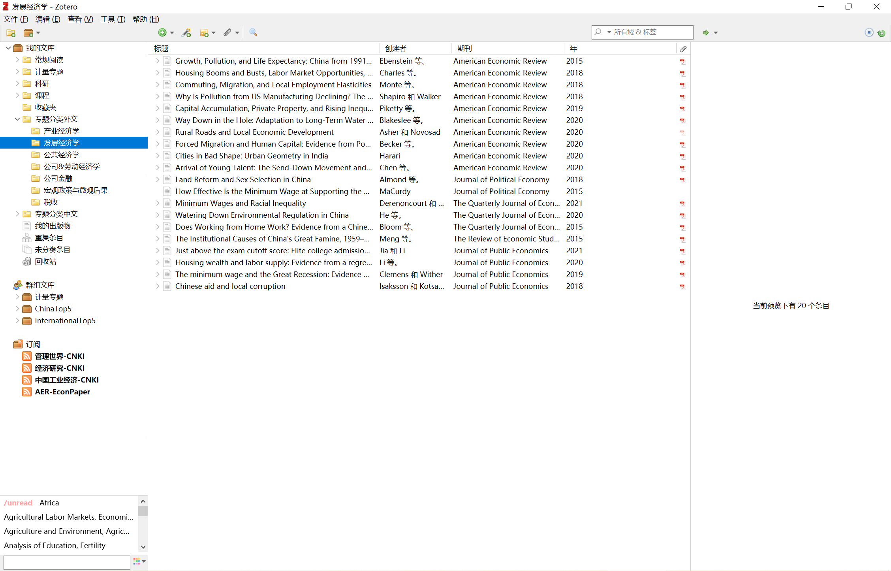

- 推荐使用，界面基于Firefox制作，可配插件较多
- 支持知网、百度学术等导入文献，配合插件效率提升UP
- 比较好用的插件：[一键下载](https://czh0575.lanzouh.com/ixmlu01myyli)，安装后请尽快更新插件（插件更新频繁，建议经常检查）
- Zotero的配置详见[Zotero配置说明](#zotero配置说明)
  
  

## 公式工具

### Mathtype7.4破解版
**下载地址：[蓝奏云](https://czh0575.lanzoui.com/ihfL0eomy6f)**

- 期刊常用公式编辑工具，难得的破解版，切勿更新。

### Mathpix Snip

**下载地址：[官网下载](https://mathpix.com/)   |    [蓝奏云](https://czh0575.lanzoui.com/iwr8Au8g7bc)**

- Latex公式OCR识别工具，准确率高，需要邮箱注册，每月50条，可用Tempmail
- 据说要收费了？

### Axmath   
**下载地址：[蓝奏云](https://czh0575.lanzoui.com/iRMl3u8gxah)**

- 跨机使用有风险

## 统计计量

### Stata

**下载地址：[天翼云盘](https://cloud.189.cn/web/share?code=vIfeaqquAz6f)  （访问码：g0xy）  |   [Stata13](https://www.123pan.com/s/qAxDVv-T23UA) |  [Stata15](https://www.123pan.com/s/qAxDVv-d23UA)    |   [Stata16](https://www.123pan.com/s/qAxDVv-v23UA)   |  [Stata17](https://pan.baidu.com/s/1-tCPEk7s4HU15OPC5D4gGA?pwd=b1qw)（提取码: b1qw）**

- 破解方法参考网络，主要是将`STATA.LIC`文件替换。

- 安装后请及时升级，目前Stata17以下均有1x.1版本，可以在Stata窗口中输入`db update`升级（必须序列号可升级），推荐[去官方](https://www.stata.com/support/updates/)手动下载后用`db update`点选文件升级。

- 关于Stata优化，参考[连玉君profile](https://gitee.com/arlionn/StataProfile)

> **[!TIP]**
>  - 亦可在 Stata 命令窗口依次输入：`cnssc install lxhget`, `lxhget profile.do`，以便把该文件 copy 到你的当前工作路径下。进入输入 `cd` 即可显示当前工作路径。
> 
> - 如果在你的 Stata 安装目录下没有 **profile.do** 文档，可以直接将我的 **profile.do** 文件放到你的 Stata 安装目录下 (我的 Stata 安装目录是：**D:\stata15**)，但需要酌情修改你里面的内容，尤其是有关文件路径方面的设定。
> 
> - 如果在你的 Stata 安装目录下已经建立了 **profile.do** 文档，但需要更新一些设定，可以打开我的 **profile.do** 文档，截取所需放入你自己的 **profile.do** 文档中。Note: 有关文件路径方面的信息，可能需要酌情修改。

- **我的Stata packages & profile（附说明）：[下载地址](https://czh0575.lanzoui.com/icbY0u8i7ra)**

    - 将Profile.do放入Stata的根目录下。
    - 在`ado`文件夹下新建`personal`和`plus`文件夹，把packages放入`plus`文件夹下。
    - 重新运行`Stata.exe`即可生效。
    

### R和R Studio

#### R

**国内镜像：[清华](https://mirrors.tuna.tsinghua.edu.cn/CRAN/)     |    [北外](https://mirrors.bfsu.edu.cn/CRAN/)     |  [中科大](https://mirrors.ustc.edu.cn/CRAN/)      |     [南京大学](https://mirrors.nju.edu.cn/CRAN/)**

#### R Studio

**下载地址：[官方下载](https://www.rstudio.com/products/rstudio/download/)**

## 笔记工具

### Typora

**下载地址：[官方下载](https://typora.io/#download)  |  [中文地址](https://www.typora.net/) |  [历史版本](https://typora.io/releases/all)**

- 最好用的Markdown编辑工具之一，实时渲染。
- 1.0版本开始改为收费制。

### LaTex

#### Texlive

**下载地址：[清华镜像](https://mirrors.tuna.tsinghua.edu.cn/CTAN/systems/texlive/Images/)**

- 文件较大，下载安装需要较长时间

#### MikTex

**下载地址：[官网下载](https://miktex.org/download)  |  [天翼云](https://cloud.189.cn/web/share?code=eEVbaui6Vfay)（访问码：r9bo）**

- 轻量使用推荐，安装后在设置中选择`管理员模式`，并将所有Packages升级，避免报错

#### TexStudio
**下载地址：[清华镜像](https://mirrors.tuna.tsinghua.edu.cn/github-release/texstudio-org/texstudio/LatestRelease/)**

- 设置中，将语言改成中文
- 设置中，选择左列`构建`，将`默认编译器`改为`XeLaTeX`

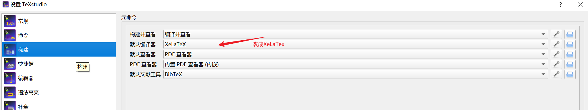

### 为知笔记
**下载地址：[官网下载](https://www.wiz.cn/zh-cn/download.html)**

- 注册账号可试用
- 全平台同步，支持Markdown格式，实时渲染

## 文献追踪与翻译

### SCITranslate 20

**[官方网站](http://www.mdtserver.com/s20.htm)      |   [官方下载](https://sciin.oss-cn-hangzhou.aliyuncs.com/scitranslate20/scitranslate20release.rar)  |   [蓝奏云（备用）](https://czh0575.lanzoui.com/izzuhv9vb5c)**

SCITranslate界面：

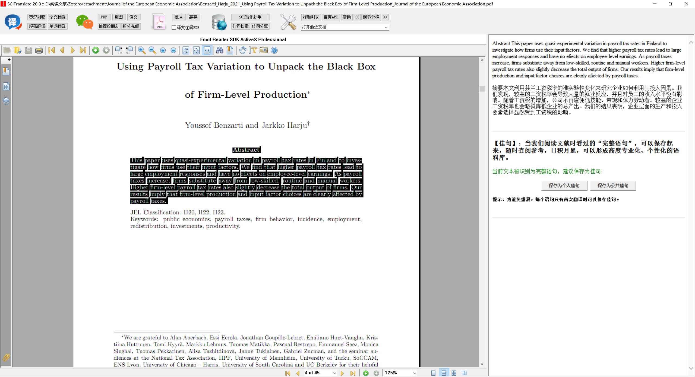

- 需使用百度翻译api，注册使用方法详见软件使用说明
- 新用户：请下载rar，解压缩，首次使用前需要安装一下，然后回到解压目录，双击scitranslate.exe即可。
- 老用户：无需下载安装，只要进入软件目录，运行一下更新程序，马上更新到最新版

### 经济学文献追踪工具

**[官方网站](https://czhweb.gitee.io/toolbox/release_update/)  |  [蓝奏云](https://czh0575.lanzouh.com/iNZ8d031nswd)**

经济学文献追踪工具界面：

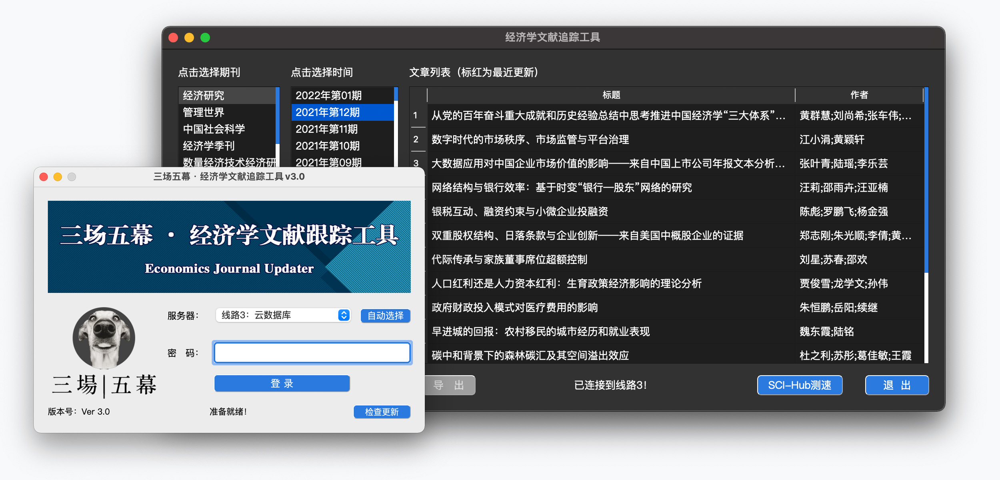

- 更新到v3.0
- 自制科研工具

## Zotero配置说明

Zotero在不同设备上同步可分为两种方式，一种借助同步工具将文件夹和数据同步（如NAS中的Drive），另一种通过Webdav同步文献（如NAS中可安装Webdav或坚果云）。注意将`Directory`及相关数据库排除在外，否则会引起冲突问题。下面介绍两种方式通过`整体同步`和`webdav`区分。

### Zotero基本配置


- 首选项--同步--设置---数据同步中，输入用户名密码登录，若使用坚果云或其他webdav（如NAS），在下面文件同步中，选择使用`WebDAV`，并输入WebDAV配置网址

  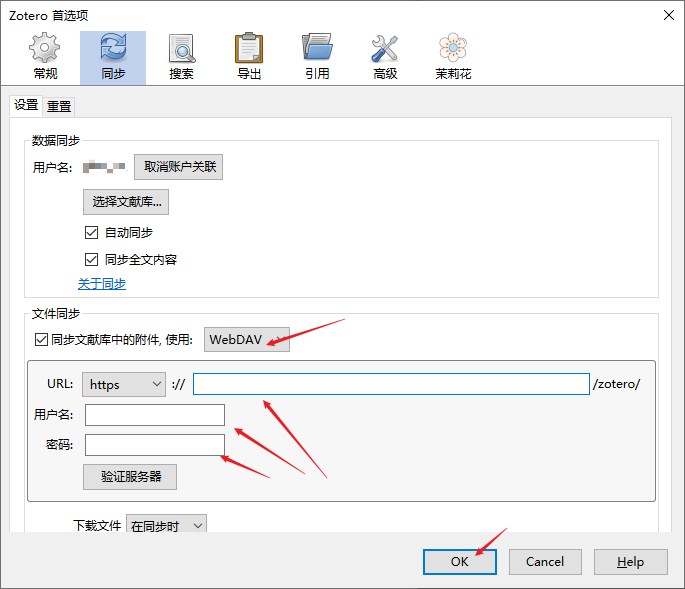

- 首选项--高级--文件和文件夹中

  - 若选择整体同步文件夹和数据，则数据存储位置选择自定义，一般为Zotero下的`Directory`目录（也可按默认位置），链接附件的根目录选择同一Zotero下的`attachment`目录。
    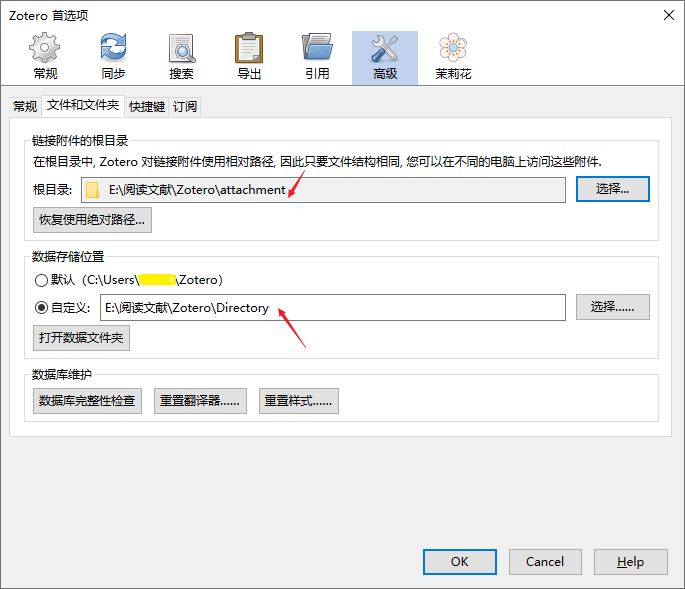

  - 若选择webdav（如坚果云，NAS）同步，则根目录选择`恢复使用绝对路径`，数据存储位置同上，选择自定义，也可以按默认位置。
    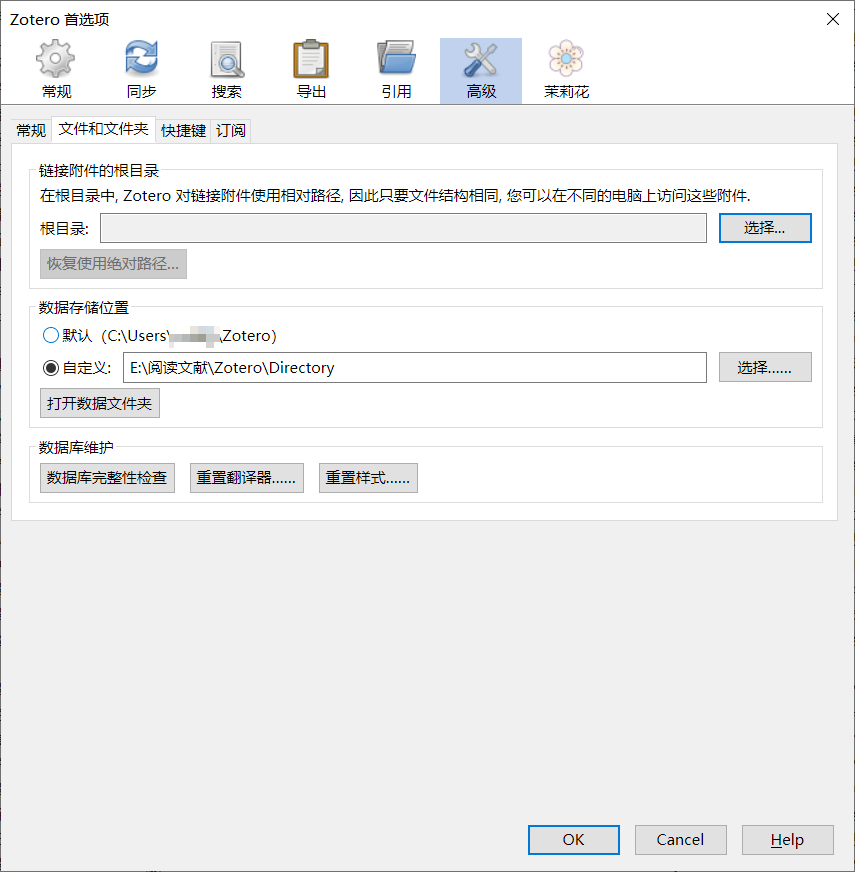

- 按下`OK`后软件关闭，手动把原来的根目录转移到新目录下，然后重新打开Zotero。


- 安装插件：[下载地址](https://czh0575.lanzouv.com/ixmlu01myyli)并解压，工具--插件--右上角齿轮按钮--Install Add-on From File，将解压后的插件一起选中加入，分别进行安装，安装后重启Zotero（_注：部分插件可能不适配最新版Zotero，可上GitHub查看更新，或安装后点选`Check for Updates`）

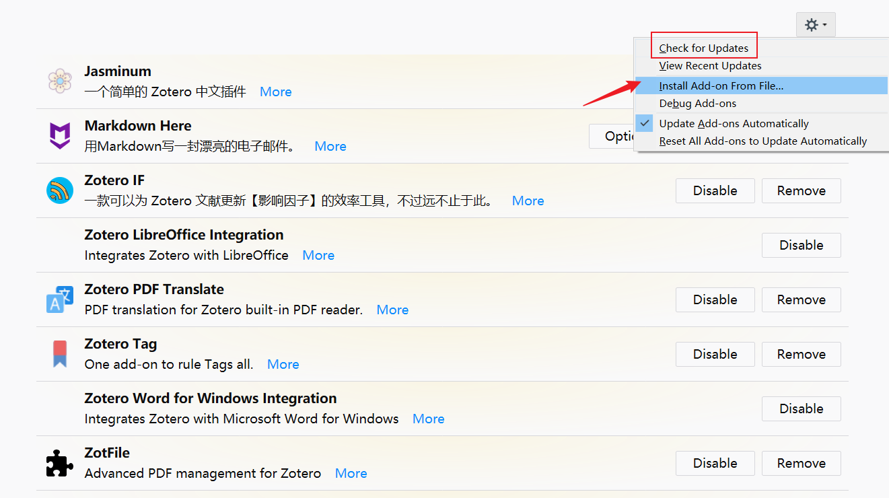

### 配置Zotfile

Zotfile主要起到文献归类的功能。在工具--Zotfile Preferences中设置：

- 在General Settings选项卡，第一个地址选择根目录下的`Download`文件夹，若没有可新建；

    - 若选择整体同步文件夹，第二个地址选择刚才首选项中设置的附件存放位置（即上一张图的第一个红箭头所在位置）；Use subfolder defined by中改为`/%w`（表示按期刊名分类，可根据自己需要更改，旁边有提示）

        

    - 若选择webdav同步方式，第二个地址选择`Attach stored copy of file(s)`，此时下方不可修改

        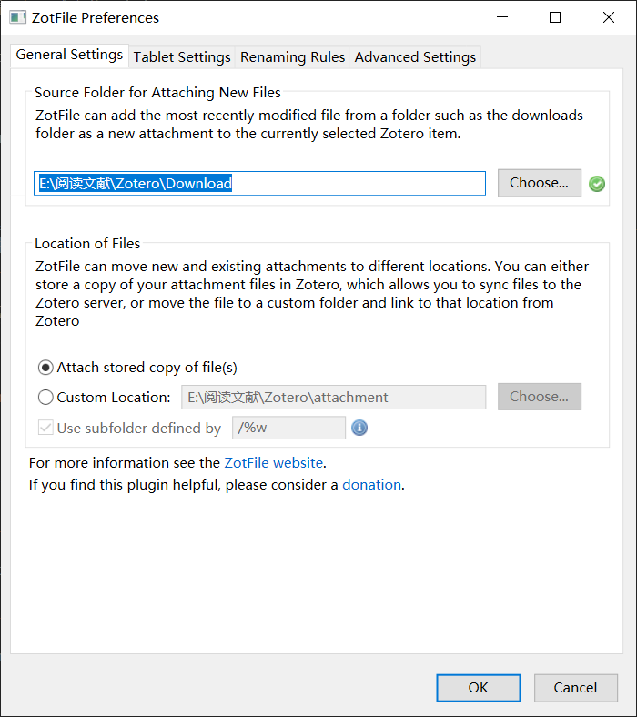


- 在Rename Rules选项卡，在`Format for all Item Types except Patents`中改成如图所示，即按`作者_年份_题目_期刊名称`重命名。其他设置默认。

    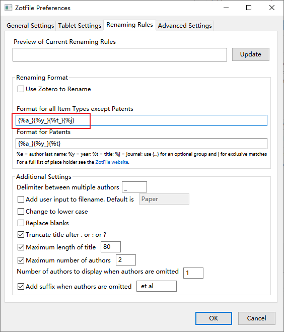

- 在Advanced Settings选项卡，选择`Always rename`，其他设置如下图。

    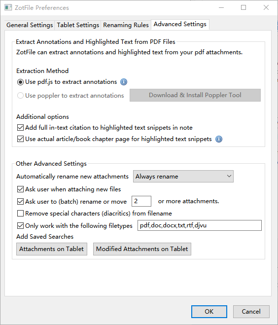

至此，Zotfile配置完成。

### 配置茉莉花（Jasminum）

茉莉花是支持中文文献（知网、万方等）抓取的补充工具，对长期需要阅读中文文献的科研狗比较友好。

- 在首选项--茉莉花--中文插件设置中，按下图配置，其他均按默认。

    

- 经常检查`非官方维护中文翻译器`选项卡，点选下方`刷新`，窗口中如有非绿色对勾（待更新项目），再点选`更新全部`。

    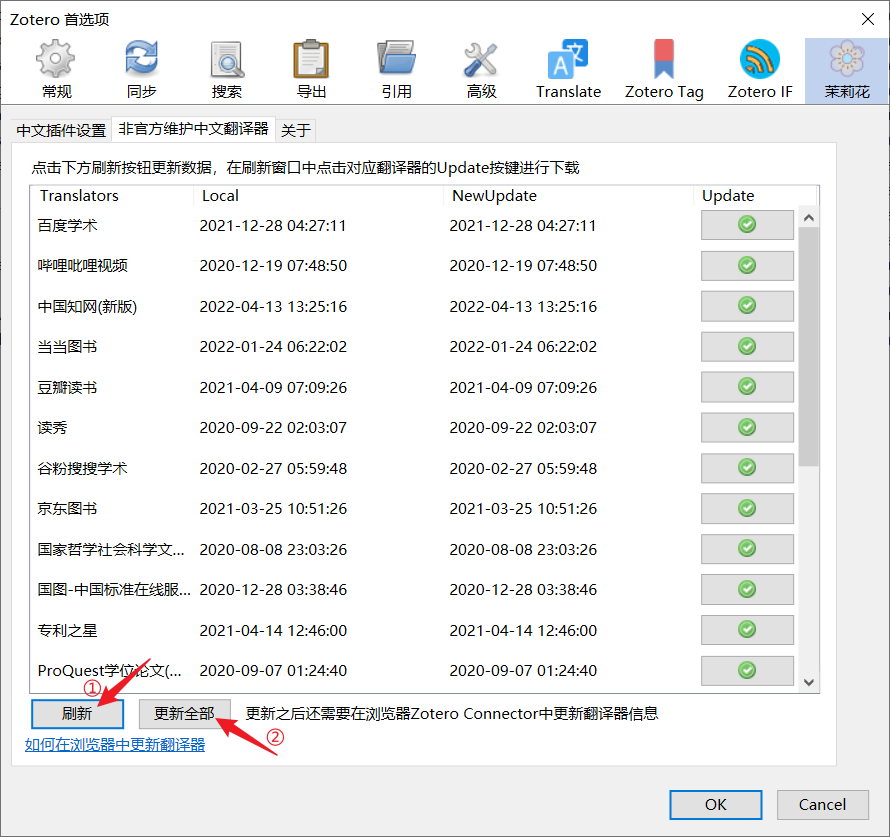

- 更新后，需要在浏览器中更新翻译器，见[Zotero更新知网Translator翻译器教程](https://www.bilibili.com/video/BV1F54y1k73n/)。

    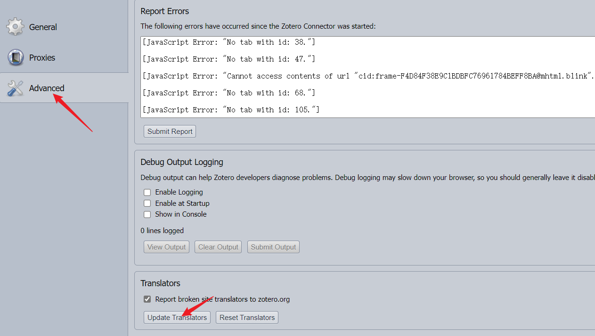


### 配置右键`找到可用的PDF`时自动查找sci-hub

- 首选项--高级--常规--设置编辑器--同意风险，在Search中搜索`pdf`，找到`extensions.zotero.findPDFs.resolvers`项目，双击项目，在弹出的窗口中填入

  ```text
  {"name":"Sci-Hub",
  "method":"GET",
  "url":"https://sci-hub.se/{doi}",
  "mode":"html", 
  "selector":"#pdf",
  "attribute":"src", 
  "automatic":true }
  ```

  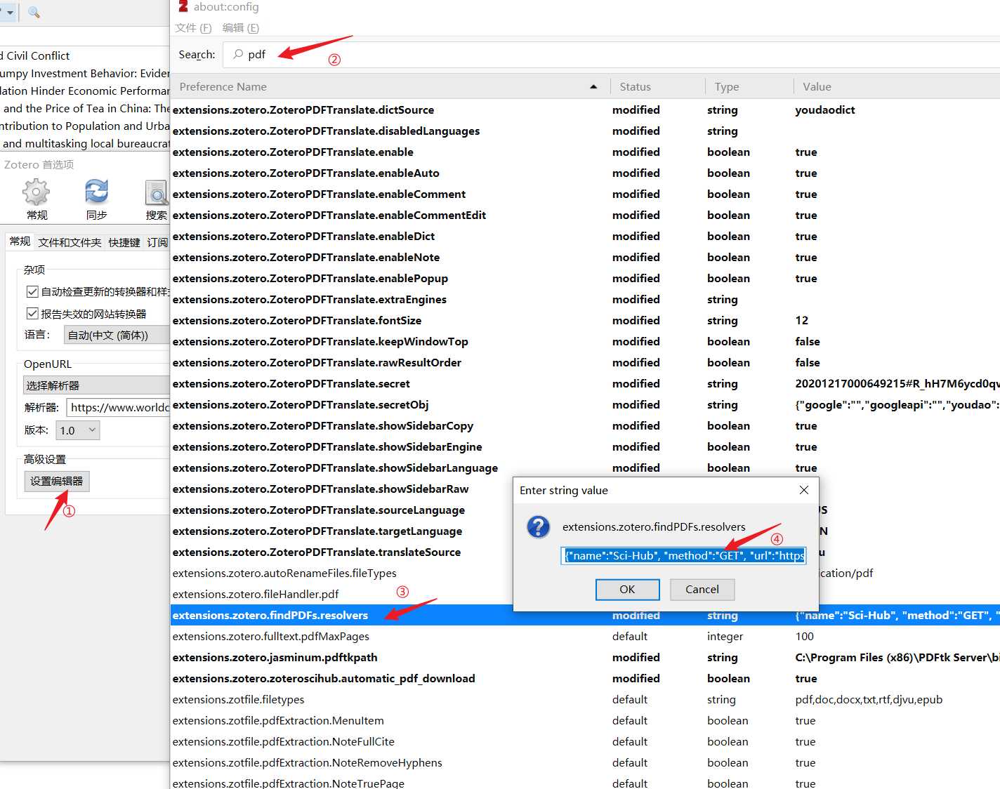

  

  