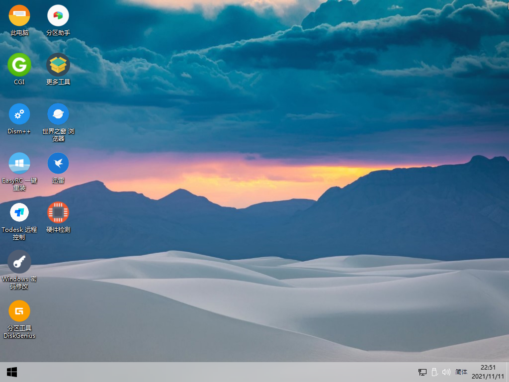
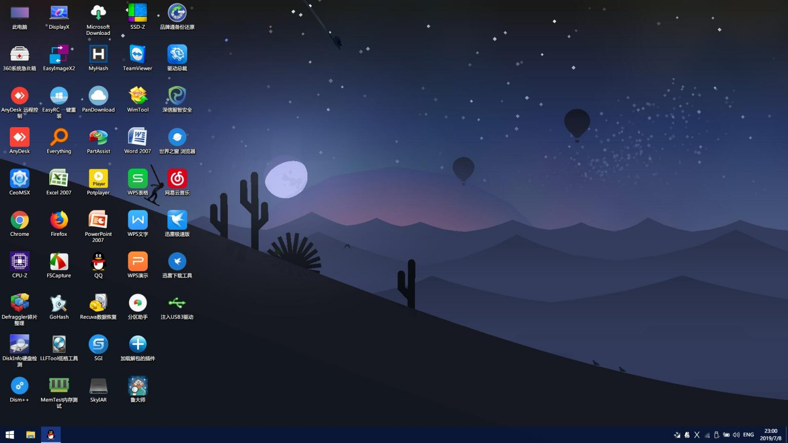
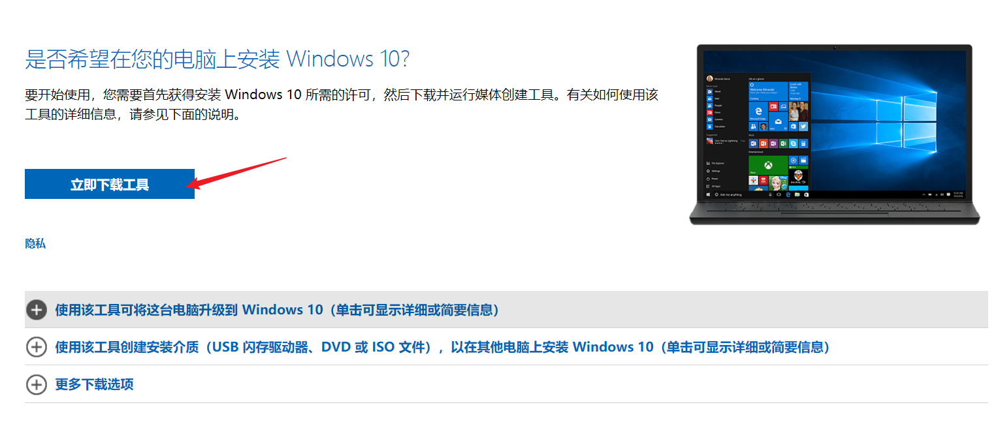

# 1. PE及安装工具

- [硬盘安装器CGI](#cgi)
- [微PE工具箱](#微pe工具箱)
- [FirPE](#firpe)
- [官方安装介质](#官方安装介质)

## CGI
**下载地址：[蓝奏云V3.2](https://czh0575.lanzoui.com/itTG0eoluod)**
- 一般在PE中自带，亦可在操作系统中启动，推荐在PE中使用
- 可恢复大多数镜像格式，如iso，wim（只能在PE中使用），gho

## 微PE工具箱

**官方网站：[http://www.wepe.com.cn/](http://www.wepe.com.cn/download.html)**

下载地址： [山东大学镜像站](https://mirrors.sdu.edu.cn/software/Windows/WePE/WePE64_V2.2.exe)  |   [太平洋V2.2](https://dl.pconline.com.cn/download/359800-1.html/)  |  [阿里云盘](https://www.aliyundrive.com/s/2XrrMYJU2gi)
- 最新版本V2.2
- 五星推荐
- 看到捐赠页面点击我已捐赠，可看到下载地址
- 下载后可安装到U盘，iso或硬盘
- 推荐下载V2.1或V2.2下载，新机型可用V2.2版本

## FirPE
**官方网站：[FirPE](http://firpe.cn/page-247)**

**下载地址：[阿里云盘](https://www.aliyundrive.com/s/PrQGSRVkeHf) | [分流下载1](https://firpe.horatio.cn/1/main) | [分流下载2](https://pan.wuenci.wang/FirPE)  | [123云盘](https://www.123pan.com/s/kkzA-t1G8v)**

- 最新版本V1.8.1
- 五星推荐
- Win11PE
- 内置多种PE环境下的工具，内置大部分网卡驱动，PE维护功能强于微PE工具箱。

界面：

加载全部插件的界面：

## 官方安装介质
**[Win10官方安装](https://www.microsoft.com/zh-cn/software-download/windows10/)**

- 碰到过一次主板太新而无法进入PE的，只能使用镜像安装，需要使用[此下载工具](https://go.microsoft.com/fwlink/?LinkId=691209)作为安装介质。

