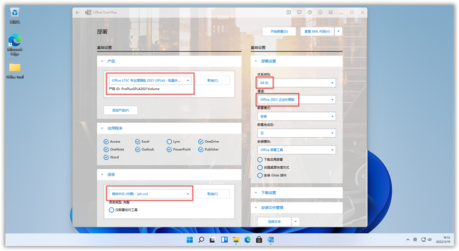
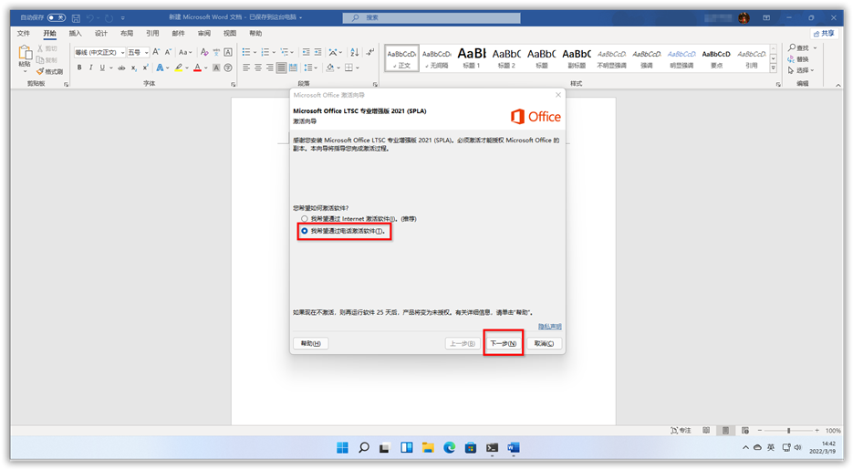
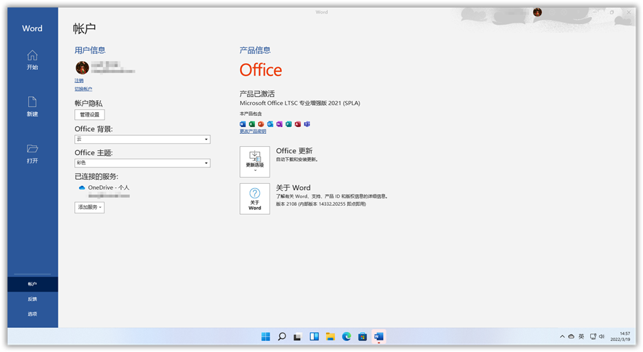

# 2. 办公软件

本节主要包括Office和PDF等，其他办公工具请在[效率工具](2-3.html)或[学术科研](2-4.html)下查找。

- [Microsoft Office](#microsoft-office)
- [WPS](#wps)
- [PDF阅读与编辑器](#pdf阅读与编辑器)
    - [Sumatra PDF](#sumatra-pdf)
    - [Adobe Acrobat Pro](#adobe-acrobat-pro)
    - [福昕高级PDF编辑器](#福昕高级pdf编辑器)
- [Office2021激活教程](#office2021激活教程)

## Microsoft Office

### 镜像ISO

**官方镜像：[MSDN itellyou旧版](https://msdn.itellyou.cn/)   |  [MSDN itellyou新版](https://next.itellyou.cn/)  |   [Windows ISO Downloader](https://czh0575.lanzoui.com/ieVpgu847cb)**

### 安装部署工具（建议）
#### Office 2013-2019 C2R Install

**下载地址：[v6.3（推荐）](https://czh0575.lanzoui.com/ia8Ggemw6yd)        |         [v7.07 b12（最新）](https://czh0575.lanzoui.com/iG560u87l5g)**

- 不能正常下载的，请将DNS改为`4.2.2.2`
- 目前仅支持2013-2019，Office2021暂不完善
- 安装完成后，可在`Utilities`中一键激活。


    

#### Office Tool Plus

**下载地址：[官网](https://otp.landian.vip/zh-cn/)  | [山东大学镜像站](https://otp.landian.vip/redirect/download.php?type=runtime&site=sdumirror)  | [Github](https://otp.landian.vip/redirect/download.php?type=runtime&site=github) |  [蓝奏云](https://czh0575.lanzoui.com/iSFRhu87uhc)**

- 一键部署Office，下载包含框架版本，运行`Runme.bat`
- 功能强大，支持几乎所有Office版本
- Office2021版本需用Office Tool Plus部署，安装LTSC批量版本
- 下载后最好手动激活或参考下方[激活教程](#office2021激活教程)


### 高校正版

> **[!WARNING]**
> 仅供厦门大学内部访问，外链需账号密码登录，侵删。

> 请先下载SHA1校验工具（下载完成后务必进行SHA1校验），推荐[iHasher](https://czh0575.lanzoui.com/itwy8u7vzzi)

- [Office 2019 x64 中文版](https://microsoft.xmu.edu.cn/assets/office_2019_64_zh_cn_1.0.0.1.iso)
> MD5校验码：8fab5dea3c8b277a06b9d1de0ab362d1

- [Office 2019 64bit English](https://microsoft.xmu.edu.cn/assets/office_2019_64_en_us_1.0.0.1.iso)
> MD5校验码：894ec717521a75a414afaac0bc5ceeaa

- [Mac Office 2019](https://microsoft.xmu.edu.cn/assets/Microsoft_Office_2019_mac_16.18.18101400.iso)
> MD5校验码：06804fe5055bb40bb299822ffd4de419

- [64位 Office 2016 中文版](https://microsoft.xmu.edu.cn/assets/SW_DVD5_Office_Professional_Plus_2016_64Bit_ChnSimp_MLF_X20-42426.ISO)
> MD5校验码：60dc8b1892f611e41140dd3631f39793

- [Office 2016 64bit English](https://microsoft.xmu.edu.cn/assets/SW_DVD5_Office_Professional_Plus_2016_64Bit_English_MLF_X20-42432.ISO)
> MD5校验码：7955af405021b1ffd93f3bd837de5d7b

- [Office激活工具](http://microsoft.xmu.edu.cn/assets/XMU.zip)  |  [使用说明](http://microsoft.xmu.edu.cn/office.html)
> MD5校验码：485cf77e20577f2dc63d2f28e661c89b

## WPS

个人版广告很多，建议下载教育版或机关政府版。注意，有时限可能失效，不行的话卸载多试几个。

网上可用的激活码：
```
694BF-YUDBG-EAR69-BPRGB-ATQXH
FLHAP-TEUGA-9MA3A-3TY3Q-V9EPD
```

### 机关政府版

**下载地址：[天翼云](https://cloud.189.cn/web/share?code=A7Nz6jjIzii2)（访问码：9typ）   |  [中石油专业增强版](https://www.123pan.com/s/qAxDVv-qn3UA)  |  [博湖县专业增强版](https://www.123pan.com/s/qAxDVv-6n3UA)  |  [海南省政府专业增强版](https://www.123pan.com/s/qAxDVv-yn3UA)**

### 教育版

**下载地址：[西北大学专业增强版](https://cloud.189.cn/web/share?code=A7Nz6jjIzii2) （访问码：9typ）  |  [云南师范大学专业增强版](https://www.123pan.com/s/qAxDVv-Vn3UA)**

### 考试专用版

**下载地址：[计算机一二级考试专用](http://ncre.neea.edu.cn/html1/report/1507/861-1.htm) |  [123云盘](https://www.123pan.com/s/qAxDVv-jn3UA)**


## PDF阅读与编辑器

### Sumatra PDF

**下载地址：[官方下载](https://www.sumatrapdfreader.org/download-free-pdf-viewer)  |  [蓝奏云](https://czh0575.lanzouh.com/iTCks04a76ra)**

- 没有PDF编辑需求可使用，轻巧便捷，可下载便携版


### Adobe Acrobat Pro

**下载地址：[天翼云盘](https://cloud.189.cn/web/share?code=VfIbqm6NzmAf)    （访问码：y14r）  |  [微博博主@vposy](https://weibo.com/u/1112829033)  （见置顶微博，推荐关注）**

- 含XI、DC版本（32bit）
- 64位OCR识别功能较差，目前建议下载32位
- 亲测2021版本一段时间后需要登录及无法使用，建议下载2020版本较为稳定。
- 如不需要PDF编辑、导出等功能，只需要查看PDF，可用免费软件[Adobe Acrobat Reader](https://get.adobe.com/cn/reader/?promoid=KSWLH)

### 福昕高级PDF编辑器

官方地址：[https://www.foxitsoftware.cn/pdf-editor/](https://www.foxitsoftware.cn/pdf-editor/)


- 最新版本V11专业版

- 安装激活说明：

    -  请从福昕[官方网站](https://www.foxitsoftware.cn/downloads/)下载`福昕高级PDF编辑器 专业版 11.0` 或`福昕PDF编辑器 Mac版 11.0`最新版本的安装包进行安装。

    - 运行福昕高级PDF编辑器，点击`激活`或在程序中点击`帮助`菜单下的`激活`

    - 如未找到激活菜单，可运行开始菜单中的`福昕高级PDF编辑器/激活`。

    - 将 **激活码** `13A3K-020H9-RZOWB-YPILM-07J89-426OJ` 填入 `永久授权` 对话框内，并选择`激活`。

    - 在 `请输入名称` 对话框内输入`您的名称`，可以是任意内容，并选择`激活`。

    - 如弹出`你要允许此应用对你的设备进行更改吗`对话框，请选择`是`。

    - 激活成功后可使用至2022年10月1日，请到期前关注本网站更新。

**激活码**（仅限厦门大学用户使用，侵删）:

**福昕高级PDF编辑器 专业版（11.0）**
```
13A3K-020H9-RZOWB-YPILM-07J89-426OJ
```

**福昕高级PDF编辑器 企业版（10.0及以前）**
```
[Foxit License]
SN=FPMC45692
Modules=General,ProEditing,IFilter,DocProcessing,FormDesigner,CertifyDocument,RMSprotector,Editing,Protection,Recognition,PDFAEXvalidation,PDFAEXconversion,RMSadvanced,Export,ActionWizard,ECM,AccessibilityFix,WIP,PSconversion,3DEditing,cPDF
Users=1
Licensee=厦门大学
ExpireDate=2022/10/15
LicenseDate=2021/10/04
Sign=576F0F9AF62190A37232DFE05B01A366743D9F287A0812D2F495AEA35B44C30D00A9B66AE41C26ED
Restrictions=Ver:11,Keyver:2,Edition:Business,Lang:zh-cn|en-us
```

## Office2021激活教程

Office2019及以前的版本可使用[HEU KMS Activator](2-1.html#heukmsactivator)或[C2R部署工具](#office-2013-2019-c2r-install)一键激活，不再赘述。下面介绍Office 2021的激活方式。

### 方法一（永久激活）

- 在Office Tool Plus中，产品选择“Office LTSC 专业增强版 2021（SPLA）”，体系结构选择64或32均可。通道选择“Office 2021企业长期版”。设置完成后，点击右上角“开始部署”，等待在线安装完成。



- 安装完毕后，首先打开Word，遇到“接受用户许可协议”等提示，接受就好了。然后就会自动弹出下图，选择“我希望通过电话激活软件”，下一步。



- 下图中“安装ID”记下来要用。


- 打开网页：[https://0xc004c008.com](https://0xc004c008.com)，将上一步的“安装ID”复制到下图的第一个框中。然后点击“Get Confirmation ID”，稍等片刻即可获得“确认ID”，填写到上图中，然后下一步。


- 大功告成，已永久激活！



PS：电话激活的网页，还可以用下面这个，由于被投诉，Edge浏览器把它标记为恶意网页，谷歌浏览器正常访问。

> [http://khoatoantin.com/cidms](http://khoatoantin.com/cidms)
> 用户名: trogiup24h | 密码 : PHO

### 方法二（KMS激活）

- 在Office Tool Plus中，产品选择`Office LTSC 专业增强版 2021`或`Office LTSC 专业增强版 2021（SPLA）`，通道选择“Office 2021企业长期版”。设置完成后，点击右上角“开始部署”，等待在线安装完成。

- 使用[HEU KMS Activator](2-1.html#heukmsactivator)一键激活，注意勾选`KMS自动续期`。