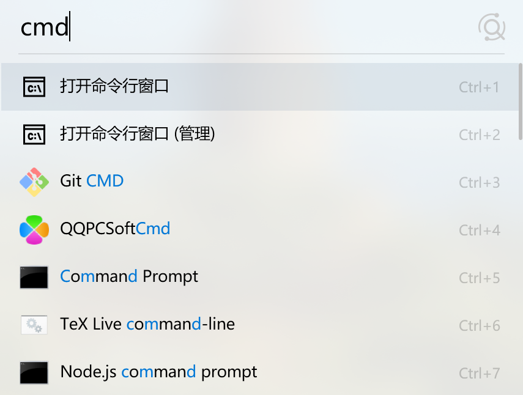
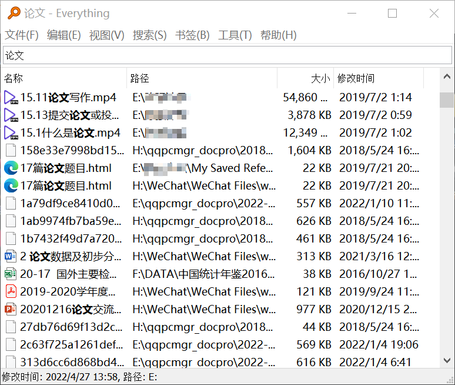
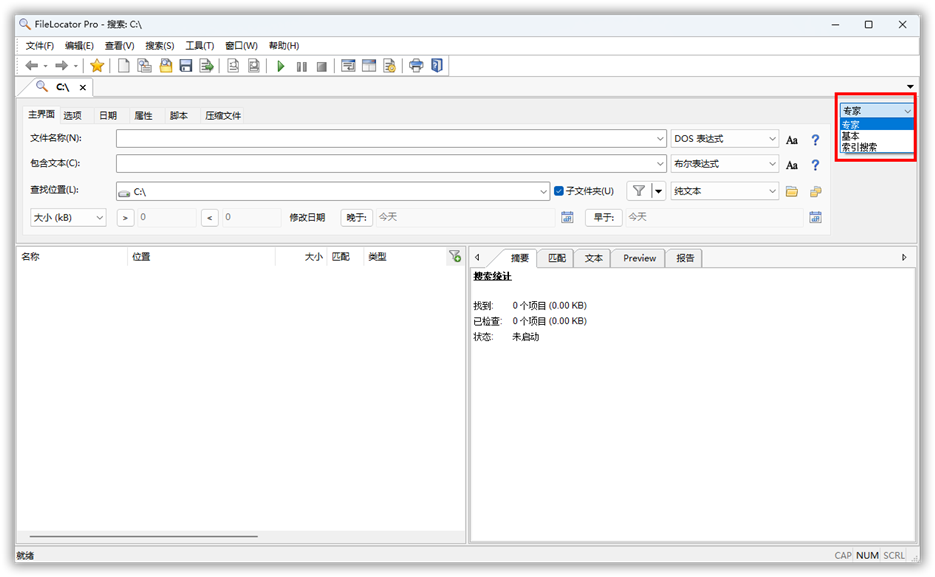
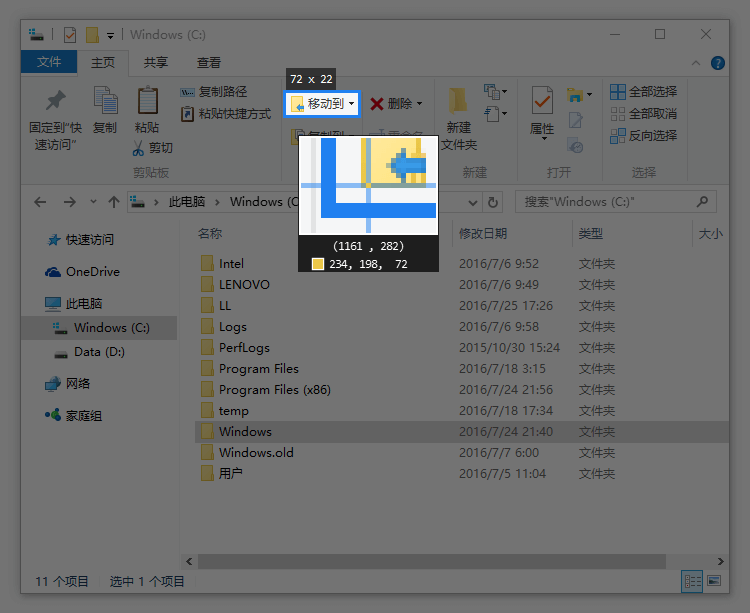

# 3. 效率工具

本节主要包括提升办公效率的工具及应用，大多需要配合主要办公软件使用。

- [文件快速搜索](#文件快速搜索)
    - [Listary](#listary)
    - [Everything](#everything)
    - [FileLocator](#filelocator)
- [截图工具](#截图工具)
    - [Snipaste](#snipaste)
- [OCR工具](#ocr工具)
    - [ABBYY FineReader](#abbyy-finereader-professional)
    - [万兴PDF](#万兴pdf)
    - [天若OCR](#天若ocr开源版v50)

## 文件快速搜索

### Listary

**下载地址：先安装[破解版](https://czh0575.lanzoui.com/iN9HTu8assj)，再更新至[最新测试版](https://www.listary.com/beta)**

- 最新版区别主要是界面上的变化，支持高分屏，如不需要可直接使用破解版
- 最大便利：`Ctrl+G`，可快速定位到文件夹
- 设置开机启动，连续按两次`Ctrl`键唤醒Listary，支持模糊搜索
- 支持快速搜索和自定义命令

Listary界面：

### Everything

**下载地址：[蓝奏云](https://czh0575.lanzoui.com/iP5cau8ay7e)   |   [官网下载](https://www.voidtools.com/zh-cn/)**

-  [图吧工具箱](2-1.html#图吧工具箱)中自带
- 快速搜索，最大特色支持批量处理

Everything界面：

### Filelocator

**下载地址：[官方网站](https://www.mythicsoft.com)  |  [破解版](https://czh0575.lanzouh.com/iejgf04a8asb)**

- 具有搜索文件内容功能，上述两个只能搜索文件名称。
- 默认情况下为“专家”模式。搜索关键词后，会花费一定的时间才能搜到结果。另一种模式为“索引搜索”，事先建立一个索引（要花费很长时间），在搜索时可以达到秒搜的效果。
- 此软件为收费软件，可以免费使用30天。当到期后，将软件目录下的`regkey.xml`删除，又可以使用30天。

Filelocator界面：

## 截图工具

### Snipaste

**下载地址：[2.6.6版本蓝奏云下载](https://czh0575.lanzoui.com/in47Hu8anxe) | [官网下载](https://zh.snipaste.com/download.html)**

- 强大的截图软件，设置开机启动，F1调出截图界面，支持编辑、取色、马赛克、画箭头、固定在屏幕等功能
- 官网下载可能较慢，遇到问题详见[使用说明](https://docs.snipaste.com/zh-cn/troubleshooting)

Snipaste界面：

## OCR工具

### ABBYY FineReader Professional

**下载地址：[v12.0破解版](https://cloud.189.cn/web/share?code=raM7jiFr26fu)（访问码：g5jp）   |   [v15.0破解版](https://pan.baidu.com/s/1LWa0PO6EWsJSxrMM1dtOTw) （提取码: hhtb）**

- 适用于图片形式的PDF的识别，主要调用OCR。所以如果本身是Word或者Excel文本格式转化而来的PDF，用办公软件中的[PDF](2-2.html#pdf阅读与编辑器)导出相应格式即可。
- 据说数字识别较差

### 万兴PDF

**下载地址：[百度网盘](https://pan.baidu.com/s/154zawqcMjKZ4dgDHKjHsQg)（提取码: t3sf）** 

- 据说数学识别较好，和Abbyy不相上下。

### 天若OCR开源版V5.0

**下载地址：[蓝奏云](https://czh0575.lanzoui.com/ilXGlu8b8if) |  [Github](https://github.com/AnyListen/tianruoocr/releases)**

- 此软件原先是免费、开源的，目前部分功能已经收费。
- 免费版最后一个开源版本为5.0版，目前已停止维护。