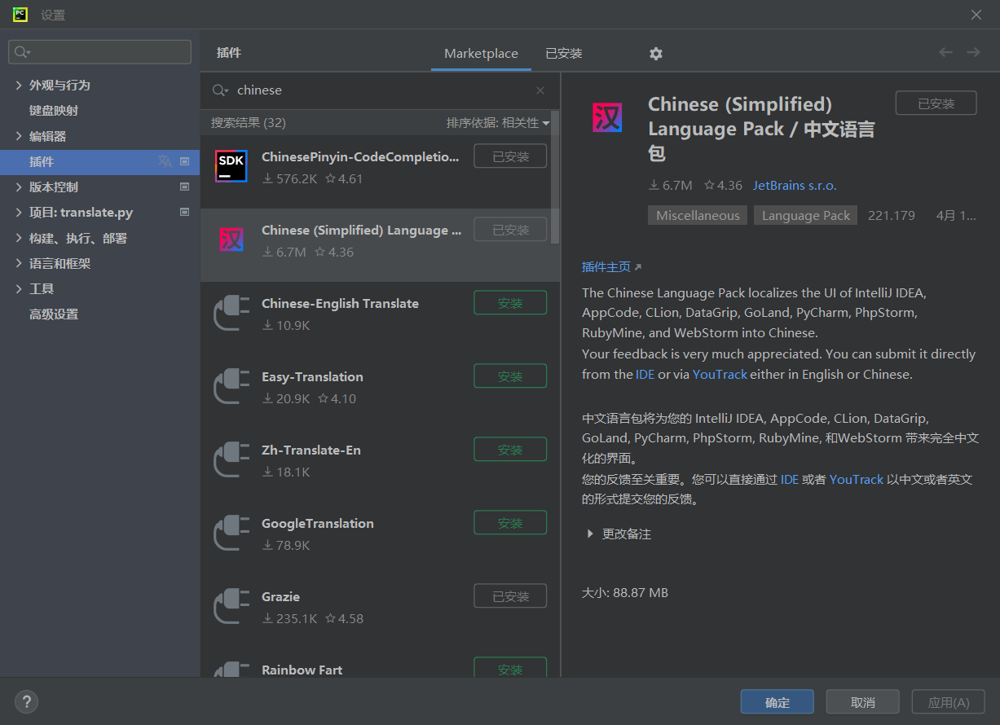

# 6. 编程开发

## Python

**下载地址：[官方下载](https://www.python.org/downloads/windows/)**

- 安装时勾选`添加到path`。

> **[!TIP]**
> **pip速度慢的解决办法**
>
> - 临时使用：可以在使用pip的时候加参数`-i https://pypi.tuna.tsinghua.edu.cn/simple`，例如：
>   
>   ```
>   pip install -i https://pypi.tuna.tsinghua.edu.cn/simple pyspider
>   ```
>
> - 永久修改：Linux下，修改 ~/.pip/pip.conf (没有就创建一个文件夹及文件。文件夹要加“.”，表示是隐藏文件夹)，Windows下，直接在user目录中创建一个pip目录，再新建文件pip.ini（例如：C:\Users\WQP\pip\pip.ini）。内容如下：
>    ```
>    [global]
>    index-url = https://pypi.tuna.tsinghua.edu.cn/simple
>    [install]
>    trusted-host=mirrors.aliyun.com
>    ```


## IDE

### PyCharm

**下载地址：[官方下载](https://www.jetbrains.com/pycharm/download/#section=windows)（下载Community版本足够）**

- 在插件中搜索`Chinese`，下载中文语言包

    

### VSCode

**下载地址：[官方下载](https://code.visualstudio.com/)**

- 还在探索中

